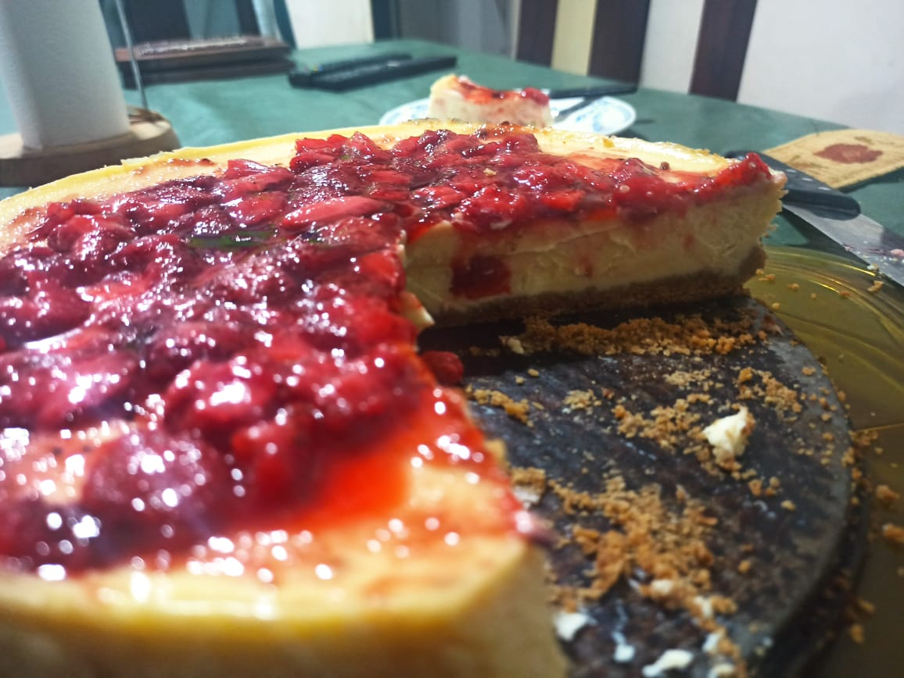
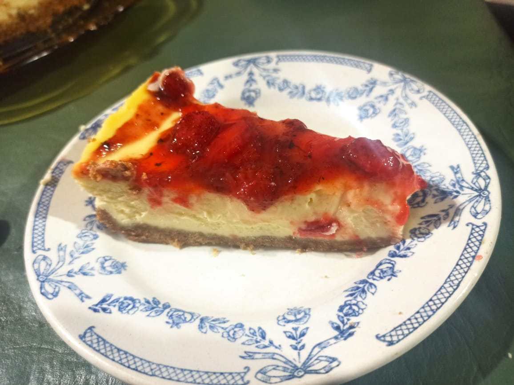

# Cheesecake

## Ingredients/Procedure

Check the reference! It's already well explained. 

I made a little variation that I think it's awesome: between the base and the filling I added a little bit of [Dulce de leche](https://en.wikipedia.org/wiki/Dulce_de_leche).

## References

- [Popurri de Sabores](https://lourdesanduaga.wixsite.com/popurridesabores/post/cheesecake)