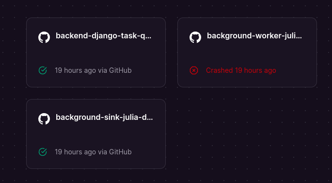

## Heroku build process

The repository to be migrated is [Background Tasks Queue](https://github.com/mattborghi/background-tasks-queue).

The services that we need to migrate are:

- The Django GraphQL API.
- The Julia Workers.
- The Julia Sink.

In order to deploy new changes to Heroku, I ran the script `RUN.prod.sh` each time there was a change, specifying the service to update. For the backend for example, the script pushed to the Heroku remote repository `push_to_heroku $backend_GIT_HEROKU_REMOTE $backend_SUBFOLDER $backend_REMOTE_BRANCH`. All the services have a Dockerfile which is specified in a `Heroku.yml` file.

## Railway migration

Starting from an empty project, I used the UI to create all these services. Then I sync the github repository, this allows to automatically deploy based on repository changes. The important step is to specify the subfolder where to run the service from. In this case, the backend subdirectory will be 'backend/' and from the worker 'results/Worker'. What I liked the most was that I could sync secret env variables from Heroku by pressing `CTRL+K`.
Finally, the Julia services have a Dockerfile that is not named just `Dockerfile` but instead `alpine.Dockerfile` or `buster.Dockerfile`. To tell Railway which file to use we need to set an environment variable called `RAILWAY_DOCKERFILE_PATH` with the Docker name.
And that's it. Now further changes are needed, it's pretty straightforward.
A drawback from Railway is that I couldn't make the Worker service work. The log is not much of a help, it just gets killed when it starts. I suspect this is due to insufficient memory assigned to the free tier.

