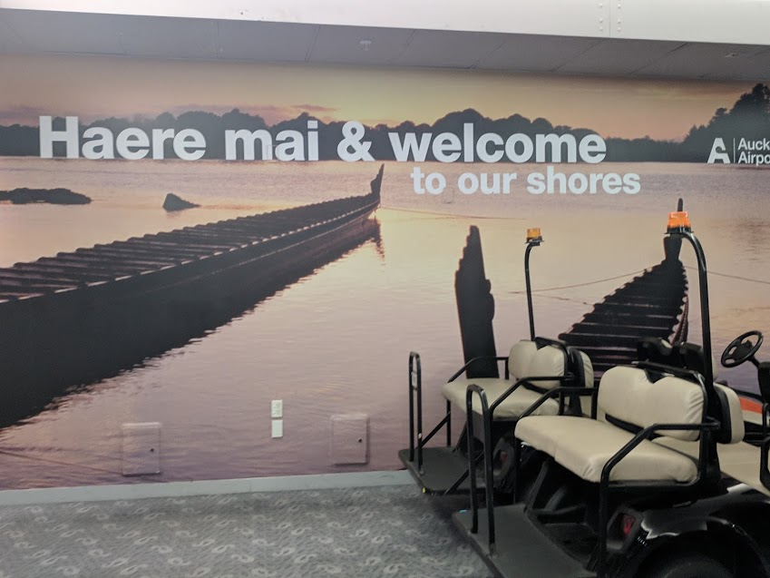
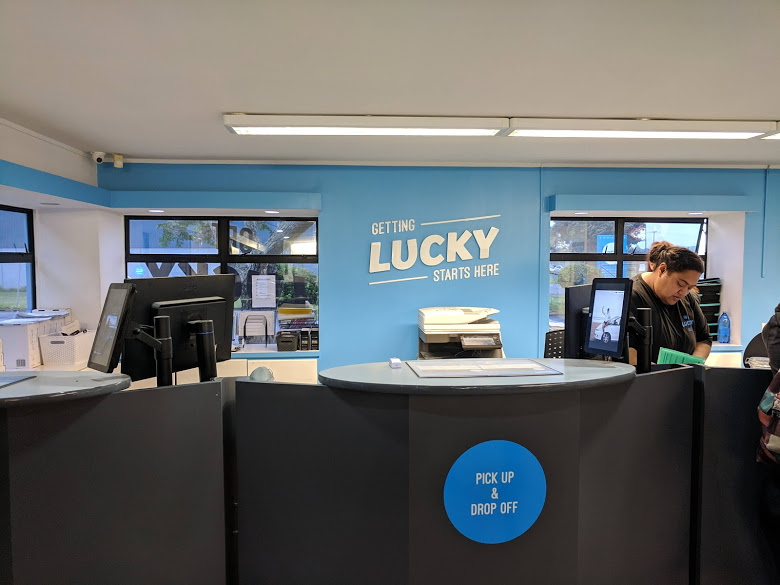
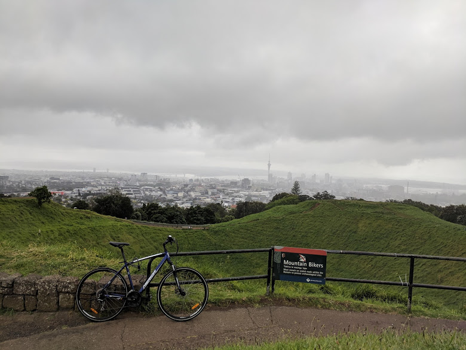
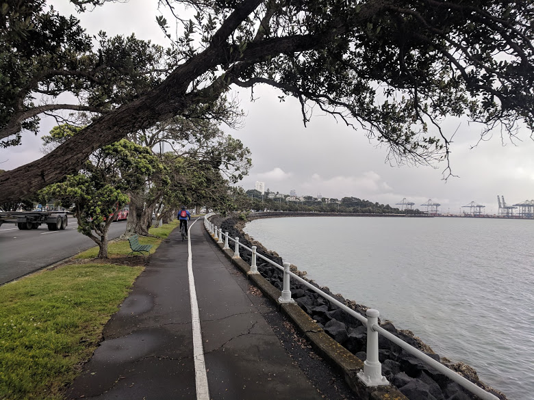
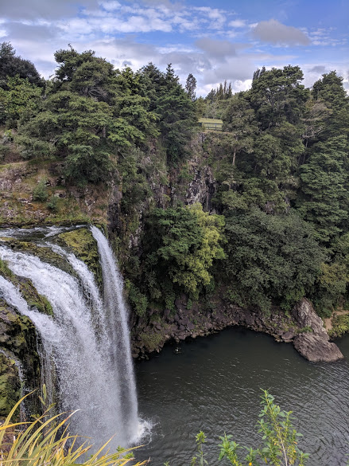

## Dia 0:

*Fig 1: Arrivando al aeropuerto de Auckland, Nueva Zelanda.*

Por mi parte compré un chip Vodafone en el free shop porque los de la campervan me pasaban a buscar al aeropuerto.
La camper la renté en [Lucky Rentals](https://www.luckyrentals.co.nz/). Teniendo en cuenta calidad precio es de los mejores lugares.

*Fig 2: Oficina de Lucky rentals en Mangere, Auckland.*

## Dia 1:

Para ver dónde quedarte y qué cosas hacer, etc. usé generalmente [Campermate](https://www.campermate.co.nz/).
El primer día dejé la camper en 26 Beach Rd, **Otahuhu**. La zona esa es semi industrial, me encantó por el hecho de que podía ir al centro (**Britomart station**) usando el tren. De noche Otahuhu es muy tranquila.

*Fig. 3: Estación de Britomart.*

Ya en el centro de **Auckland**, alquilé una bici en [HireBikes](https://www.hirebikes.co.nz/) 99 Beach rd (nada que ver con la calle anterior). Tenés que ir preparada para que llueva y pare constantemente. Yo por momentos me moría de frío pero fue increíble. Estuve 4 hs andando aproximadamente pero no te das cuenta prácticamente. Recorrí **Mount Eden** y toda la costa desde el puerto hasta que tuve ganas de andar.

*Fig. 4: Monte Eden.*

*Fig. 5: Tamaki Dr, Auckland.*

Alrededor de las 18hs pegué la vuelta a Otahuhu.
Luego fui al súper a comprar comida (**Pak'nSave** de Mangere). Lo bueno de esa zona es que es relativamente más barato que el centro de Auckland.

## Dia 2:

Lo malo es que pagas un día mas de la camper pero salís tranquilo al día siguiente, en mi caso, hacia el norte, pensando en llegar hasta **Cape Reinga** (Spoiler alert: no llegamos ese día). Previo a eso pasé por un **The Warehouse** para comprar un cargador de celular para el auto. Es clave eso, el primer día me quede sin batería bastante rápido. Fuimos parando en algunos Scenic Lookouts y luego en **Waipu Caves**. Como en toda cueva hay que tener en cuenta que las zapatillas se te pueden llenar de barro. Luego paramos en **Whangarei** para comer especialmente en el **Tikipunga park**. 

*Fig. 6: Tikipunga Park, Whangarei.*

Muy lindo lugar ubicado a una cuadra de las **Whangarei Falls Scenic Reserve**, que es donde fuimos después de comer. 

*Fig. 7: Whangarei Falls Scenic Reserve.*

Luego de eso seguimos rumbo al norte y paramos en el **90 Mile Beach Holiday Park**. Tenía pensado ir a otro lugar pero llegamos justo en el único día del año que cerraban por reformas.

*Fig. 8: 90 Mile Beach Holiday Park, Waipapakauri.*
