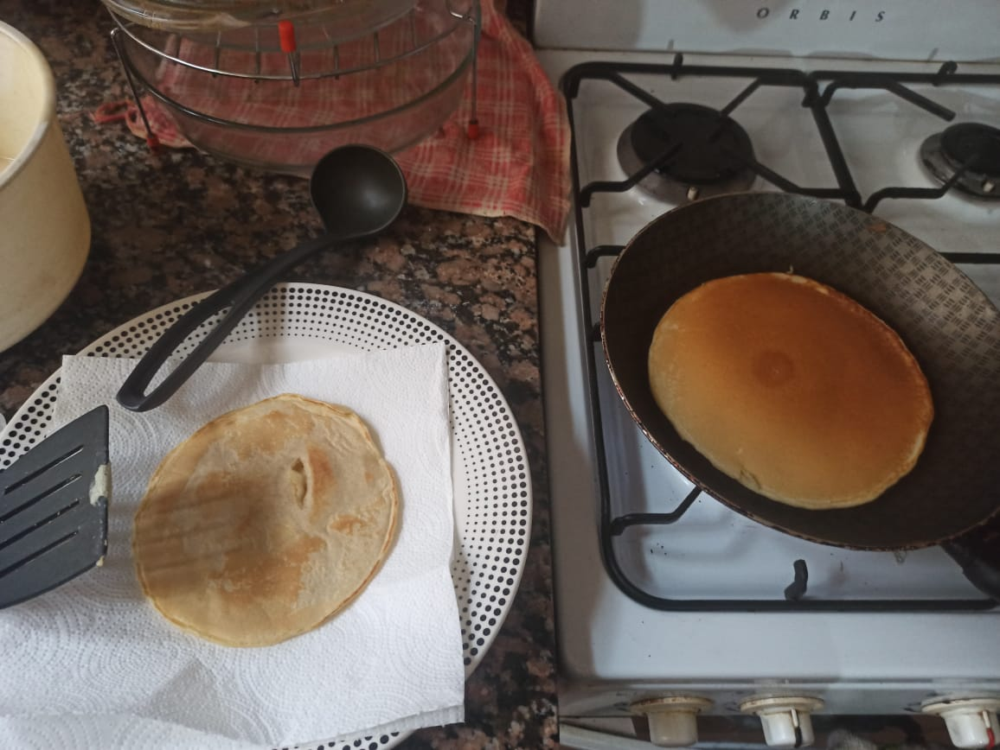

# Pancakes

## Ingredients

- 150 gr de harina de trigo.
- 1 cucharada sopera de azúcar.
- 8 gr de levadura en polvo o impulsor químico (aproximadamente una cucharada sopera).
- 1 pizca de sal.
- 200 ml de leche.
- 1 huevo.
- 1 cucharadita de manteca.

## Procedimiento

- En un bol pon los ingredientes secos: la harina, el azúcar, el impulsor químico o levadura en polvo y la sal. Mézclalos bien.
- Derrite la mantequilla. Para ello, puedes ponerla en un pequeño vasito durante 5-10 segundos en el microondas y listo.
- En otro bol junta el huevo con la leche y la mantequilla, y bate con unas varillas para que quede perfectamente mezclado.
- Ve echando el líquido encima del bol de los ingredientes secos poco a poco mientras vas mezclándolo con unas varillas, así te aseguras de que no quedarán grumos. ¡La masa está lista!
- Coge una sartén pequeña antiadherente (o grande si quieres preparar varias tortitas a la vez) y ponla encima del fuego, que deberá estar a temperatura media-alta. Ah, y no necesitas untarla con mantequilla o aceite, pues la mantequilla que hemos añadido a la masa ya hace que no se peguen (siempre que tu sartén sea antiadherente, ¡claro!).
- Lo ideal es que pongas la masa en una jarra o recipiente desde el que puedas ir echando la masa. Vierte un poquito de masa, o más bien la suficiente como para que la tortita sea del tamaño que prefieras.
- Espera a que las burbujas que se van creando suban a la superficie, y cuando eso ocurra, dale la vuelta y cocina apenas unos 10 segundos más. Ve colocándolas en un plato, tápalas con un mantel de algodón por encima y prepara el resto.

Si te ha quedado muy dorada deberás baja la temperatura de tu fuego un poco, y si ves que te desesperas hasta que se dora un poco, súbelo. La primera tortita te sirve para ajustar la temperatura ideal.

## Referencias

- https://www.recetasdeescandalo.com/como-hacer-tortitas-americanas-caseras-o-pancakes-la-mejor-receta/